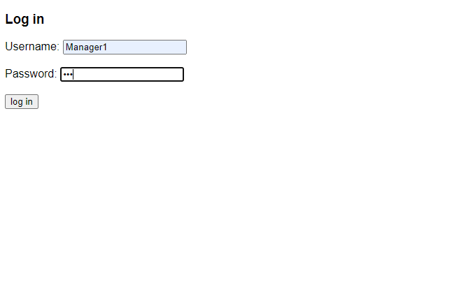
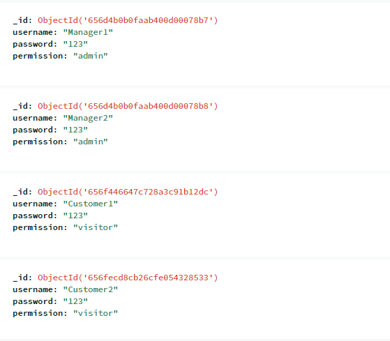
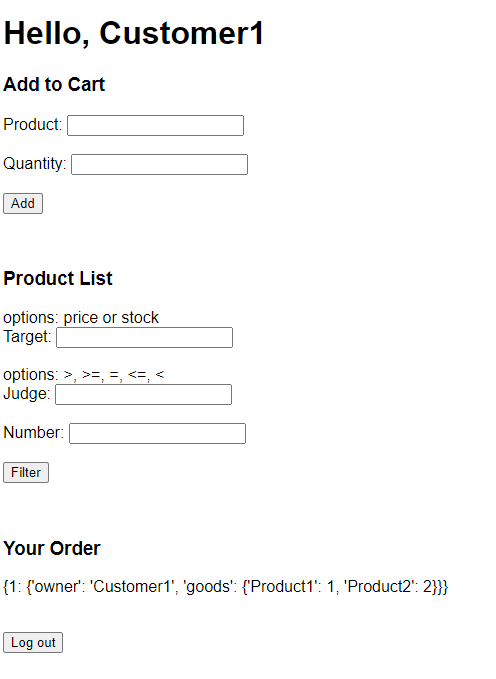

# Order System
這是一個利用 __Python Flask__ 和 __MongoDB Atlas__ 建立的簡易訂單系統，main function 及各 route 定義與實作在 `app.py` 檔案中，而 APIs 則定義與實作於 `util.py` 當中。`db.py` 用於實現與資料庫連線的功能。

## Instructions
```shell
~$ cd order-system
~$ python app.py
```

* 登入畫面，資料庫已經建立了五位角色分別為: Manager1, Manager2, Customer1,
Customer2, Customer3，密碼都設定為 123。使用者可以隨意使用其中一個角色登入並使用功能。



* Manager 畫面，在這裡可以使用 Manager 權限的功能，包含創建、編輯、刪除 Product，目前前端這邊都採用輸入 Text 的方式設計，所以在使用這三項功能十都必須將表單填滿，如果有其中一項缺漏便會跳轉至 Error Page。而下面 Product List 的部分可以填入篩選條件，全空的話代表列出所有 Products，也可以填入篩選條件針對 price | stock 的數量進行篩選。最下方是 Order List，列出了所有客戶的訂單。  


* Costomer 畫面，在這裡可以使用 Costomer 權限的功能，下訂單功能採用購物車的方式設計，後端設計是可以一次接收多種 Products 以及其數量，符合需求。但前端這邊使用者必須一次新增一種 product 及其數量，然後進到購物車頁面，該頁面會列出購物車目前裝載之商品，此時可以決定送出訂單，抑或是 Back 繼續新增。購物車這邊是利用 Session 的方式先做存取，而後送出訂單時將整筆訂單資料丟到後端 API 進行。加入購物車時會先跟資料庫溝通檢查商品名稱與庫存是否足夠，而送出訂單時會進行二次檢查，如果檢查通過便會扣除該商品的庫存量 stock，並且把該商品的 ordered 狀態標記為 True，此時 Manager 就無法將其刪除。下方同樣有 Product List 以及該客戶自己的 Orders。  

